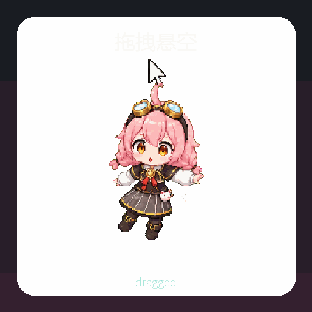

# Taffy Agent

[English](README.en.md)

[](https://github.com/arathustr/taffy-agent/actions/workflows/ci.yml)


Taffy Agent 是一个面向 **Computer Use** 的图形化 Agent 终端。它把浏览器观察、Codex 编程任务、Shell/File 操作、DeepSeek 推理、风险审批、任务时间线和本地语音反馈整合到一个可悬浮的角色化 UI 中。

它不是“聊天窗口套皮”，也不是普通桌宠。塔菲在这里承担的是 **任务入口、状态指示器、审批入口、语音反馈层和工作台外壳**：平时像无边框桌面终端一样悬浮，收到复杂任务时展开控制台，适合承载类似 Hermes / OpenClaw 方向的多工具 Agent 工作流。

> 粉丝自用与研究项目，非官方项目，非商业用途。仓库包含用户提供数据训练得到的 GPT-SoVITS 推理权重和一段短参考提示音频，用于本地演示；不包含官方 Live2D、拆包贴图、原始训练集或商业素材。


## 语音试听

这段试听由仓库内置的本地 GPT-SoVITS v2ProPlus 塔菲音色合成，台词为：“嗯，雏草姬，塔菲在这里喵。浏览器和 Codex 的任务，都可以交给塔菲先看一下。”

<audio controls src="docs/assets/audio/taffy-agent-voice-demo.wav"></audio>

如果 GitHub 没有显示播放器，可以直接打开 [taffy-agent-voice-demo.wav](docs/assets/audio/taffy-agent-voice-demo.wav)。

## 目录

- [语音试听](#语音试听)
- [项目在做什么](#项目在做什么)
- [功能地图](#功能地图)
- [当前完成度](#当前完成度)
- [快速开始](#快速开始)
- [完整部署](#完整部署)
- [配置说明](#配置说明)
- [本地塔菲语音](#本地塔菲语音)
- [Codex 与浏览器工作流](#codex-与浏览器工作流)
- [项目结构](#项目结构)
- [美术与语音来源说明](#美术与语音来源说明)
- [安全边界](#安全边界)
- [路线图](#路线图)

## 项目在做什么

Taffy Agent 的目标是做一个 **可视化、本地优先、可审计的 computer-use agent terminal**。用户可以直接在悬浮角色旁输入任务，例如：

- “打开浏览器查一下这个项目的最新文档，帮我总结要点。”
- “把这个需求交给 Codex，在当前仓库里实现并跑测试。”
- “看一下当前工作区有哪些文件，判断项目结构。”
- “运行这条命令，但执行前先让我确认。”
- “把任务状态、日志和审批记录都显示出来，我要知道它在干什么。”

角色层的价值不是卖萌本身，而是让工具调用不再藏在黑箱里：塔菲会用动作状态、气泡、语音、审批卡片和任务时间线告诉你现在是在听、在想、在执行、在等确认、还是失败了需要接管。

## 功能地图

### 图形化 Agent 终端

- 透明、无边框、置顶的悬浮角色窗口。
- 悬浮态可直接输入任务，不需要先打开传统聊天页。
- 气泡默认 10 秒消失，可关闭或固定。
- 复杂任务进入完整工作台：设置、日志、审批、任务时间线、工具结果都在里面。
- 系统托盘可隐藏/恢复 Taffy Agent。

### LLM 与任务路由

- DeepSeek 官方 API provider。
- Mock provider，适合无密钥演示和开发。
- 默认/高级模型名可配置，当前默认示例为 `deepseek-v4-flash` / `deepseek-v4-pro`。
- 意图路由会把用户输入分到聊天、浏览器、Codex、Shell、文件、设置等任务类型。

### Codex 编程任务

- 检测本机 `codex` CLI。
- 将用户需求构造成 handoff prompt，并调用 `codex exec`。
- 不读取、不保存、不修改 Codex 账号、API key 或模型设置。
- Codex 任务属于高影响动作，默认会进入审批流程。

### 浏览器观察

- 打开 URL 或搜索关键词。
- 读取页面标题、URL、可见文本。
- 提取链接、按钮、表单信息。
- 截图并识别基础登录状态。
- 登录、验证码、2FA、付款等流程保留用户接管。

### Shell / File 工具

- Shell 命令通过 PowerShell 执行。
- 文件桥接可读取/列出工作区内容。
- 策略层会根据风险要求确认，避免模型直接执行危险命令。

### 本地语音

- 支持本地 GPT-SoVITS、系统语音、HTTP TTS。
- 仓库通过 Git LFS 提供训练后的塔菲 GPT-SoVITS v2ProPlus 推理权重。
- 内置分句合成、队列播放、短句缓存、音量和语速设置。
- TTS 会过滤括号动作，避免把“（眨眨眼）”这类舞台动作读出来。

### 动态角色状态

- 当前包含 12 组生成式像素状态动画。
- 状态会随任务变化：待机、思考、问候、完成、出错、休眠、执行、拖动、倾听、浏览器、等确认、庆祝。
- 提供生成式美术流水线：参考图、生图、抠图、绿边清理、帧对齐、sprite sheet、GIF 导出。

## 当前完成度

| 能力 | 状态 | 说明 |
| --- | --- | --- |
| 悬浮角色终端 | 已实现 | 透明无边框、置顶、可拖动、托盘恢复 |
| 悬浮输入 | 已实现 | 角色旁可直接提交任务 |
| 任务工作台 | 已实现 | 设置、日志、审批、任务时间线 |
| DeepSeek / Mock LLM | 已实现 | API key 走本地 `.env` |
| Codex handoff | 已实现 | 调用本机 `codex exec` |
| 浏览器观察 | 已实现 | 打开/搜索/读取/截图/表单与按钮提取 |
| Shell 命令 | 已实现 | 策略确认后执行 PowerShell |
| 文件查看 | 已实现 | 工作区文件桥接 |
| 风险审批 | 已实现 | 高风险动作需要用户确认 |
| 本地塔菲语音 | 已实现 | GPT-SoVITS 权重随仓库 LFS 提供 |
| 状态动画 | 已实现 | 12 组像素状态动画和宣传 GIF |
| 浏览器点击/输入自动化 | 规划中 | 当前以观察和用户接管为主 |
| 长程自主任务 | 规划中 | 需要更强权限、记忆、审计和恢复 |

## 演示


<details>
<summary>查看单独状态 GIF</summary>

| 状态 | 预览 | 触发场景 |
| --- | --- | --- |
| 待机 |  | 空闲等待 |
| 思考 |  | 规划、等待工具返回 |
| 问候 |  | 唤醒、点击、短交互 |
| 完成 |  | 任务完成、测试通过 |
| 出错 |  | 命令失败、需要介入 |
| 休眠 |  | 长时间空闲 |
| 执行 |  | 写代码、运行命令、调用 Codex |
| 拖动 |  | 移动悬浮终端 |
| 倾听 |  | 等待用户输入 |
| 浏览器 |  | 浏览器观察和搜索 |
| 等确认 |  | 高风险动作审批 |
| 庆祝 |  | 任务阶段完成 |

</details>

## 快速开始

适合只想先看 UI 和基础流程的用户。Mock 模式不需要 DeepSeek key，也不会消耗 API 额度。

环境要求：

- Windows 10/11
- Node.js 20+
- Git LFS，用于拉取内置语音权重

```powershell
git clone https://github.com/arathustr/taffy-agent.git
cd taffy-agent
git lfs install
git lfs pull
npm install
Copy-Item .env.example .env
npm run dev
```

如果只想构建本地发布目录：

```powershell
npm run package
& ".\release\win-unpacked\Taffy Agent.exe"
```

验证命令：

```powershell
npm run typecheck
npm run lint
npm test
npm run build
```

## 完整部署

### 1. 准备 `.env`

```powershell
Copy-Item .env.example .env
```

默认 `.env.example` 是安全演示配置：

- `TAFFY_USE_MOCK_LLM=true`：不调用真实 LLM。
- `TAFFY_TTS_ENABLED=false`：先不启用语音。
- Codex 不需要在 Taffy 内配置 key。

### 2. 启用 DeepSeek

注册 DeepSeek 官方 API 后，在 `.env` 中填写：

```env
DEEPSEEK_BASE_URL=https://api.deepseek.com
DEEPSEEK_API_KEY=sk-...
TAFFY_USE_MOCK_LLM=false
TAFFY_DEFAULT_MODEL=deepseek-v4-flash
TAFFY_ADVANCED_MODEL=deepseek-v4-pro
```

模型名只是默认示例，可以按 DeepSeek 官方当前可用模型调整。

### 3. 启用 Codex

Taffy Agent 不接管 Codex 账号。你只需要在本机先把 Codex CLI 配好：

```powershell
codex --version
codex auth login
```

确认 Codex 可用后，在 Taffy 设置里打开 Codex 权限。之后用户发起编程任务时，Taffy 会先展示审批卡片，再把任务交给 `codex exec`。

### 4. 启用本地塔菲语音

语音需要两部分：

- 本仓库内置的 Taffy GPT-SoVITS 推理权重。
- GPT-SoVITS 本体和运行环境。

最短路径见 [本地塔菲语音](#本地塔菲语音)。

### 5. 启动应用

开发模式：

```powershell
npm run dev
```

打包目录：

```powershell
npm run package
& ".\release\win-unpacked\Taffy Agent.exe"
```

发布包会读取当前目录或 exe 同目录的 `.env`；也可以用 `TAFFY_ENV_PATH` 指定配置文件。

## 配置说明

复制 `.env.example` 为 `.env` 后按需修改：

| 变量 | 默认值 | 用途 |
| --- | --- | --- |
| `DEEPSEEK_BASE_URL` | `https://api.deepseek.com` | DeepSeek API 地址 |
| `DEEPSEEK_API_KEY` | 空 | DeepSeek API key，只保存在本地 |
| `TAFFY_DEFAULT_MODEL` | `deepseek-v4-flash` | 默认模型名 |
| `TAFFY_ADVANCED_MODEL` | `deepseek-v4-pro` | 高级模型名 |
| `TAFFY_USE_MOCK_LLM` | `true` | 使用 Mock 模式，不调用真实 LLM |
| `TAFFY_TTS_ENABLED` | `false` | 是否启用语音 |
| `TAFFY_TTS_PROVIDER` | `gpt-sovits` | 语音 provider |
| `TAFFY_TTS_ENDPOINT` | `http://127.0.0.1:9880/tts` | GPT-SoVITS API 地址 |
| `TAFFY_TTS_VOLUME` | `0.78` | 音量 |
| `TAFFY_TTS_REALTIME` | `true` | 是否分句合成播放 |
| `TAFFY_TTS_CHUNK_CHARS` | `52` | 分句目标长度 |
| `TAFFY_TTS_CACHE` | `true` | 是否缓存常用短句 |
| `TAFFY_TTS_REF_AUDIO` | `reference_audio/taffy_prompt.wav` | GPT-SoVITS 参考音频 |
| `TAFFY_TTS_PROMPT_TEXT` | `下播了喵。拜拜喵。` | 参考音频对应文本 |
| `TAFFY_TTS_SPEED` | `1.04` | 语速 |

完整示例：

```env
DEEPSEEK_BASE_URL=https://api.deepseek.com
DEEPSEEK_API_KEY=
TAFFY_DEFAULT_MODEL=deepseek-v4-flash
TAFFY_ADVANCED_MODEL=deepseek-v4-pro
TAFFY_USE_MOCK_LLM=true
TAFFY_TTS_ENABLED=false
TAFFY_TTS_PROVIDER=gpt-sovits
TAFFY_TTS_ENDPOINT=http://127.0.0.1:9880/tts
TAFFY_TTS_VOLUME=0.78
TAFFY_TTS_REALTIME=true
TAFFY_TTS_CHUNK_CHARS=52
TAFFY_TTS_CACHE=true
TAFFY_TTS_TEXT_LANG=zh
TAFFY_TTS_PROMPT_LANG=zh
TAFFY_TTS_REF_AUDIO=reference_audio/taffy_prompt.wav
TAFFY_TTS_PROMPT_TEXT=下播了喵。拜拜喵。
TAFFY_TTS_SPEED=1.04
```

## 本地塔菲语音

仓库内置训练好的 GPT-SoVITS v2ProPlus 推理包，位于 `voice-models/gptsovits/taffy-v2proplus/`。大文件通过 Git LFS 管理：

- `GPT_weights_v2ProPlus/Taffy-e15.ckpt`
- `SoVITS_weights_v2ProPlus/Taffy_e8_s608.pth`
- `reference_audio/taffy_prompt.wav`
- `taffy_tts_infer.yaml`
- `checksums.sha256`

本仓库不包含 GPT-SoVITS 本体和预训练底模。推荐把 GPT-SoVITS 放在忽略目录：

```text
voice-workspace/GPT-SoVITS/
```

安装示例：

```powershell
New-Item -ItemType Directory -Force voice-workspace
git clone https://github.com/RVC-Boss/GPT-SoVITS.git voice-workspace/GPT-SoVITS
conda create -n GPTSoVits python=3.10
conda activate GPTSoVits
pwsh -ExecutionPolicy Bypass -File scripts/install-gptsovits.ps1 -Device CU128 -Source ModelScope
```

启动本地 API：

```powershell
conda activate GPTSoVits
pwsh -ExecutionPolicy Bypass -File scripts/start-gptsovits-api.ps1 -Background
```

启动脚本会自动把内置权重、参考音频和 `taffy_tts_infer.yaml` 同步到 GPT-SoVITS 工作目录。只同步不启动：

```powershell
pwsh -ExecutionPolicy Bypass -File scripts/start-gptsovits-api.ps1 -SyncOnly
```

然后在 `.env` 中启用：

```env
TAFFY_TTS_ENABLED=true
TAFFY_TTS_PROVIDER=gpt-sovits
TAFFY_TTS_ENDPOINT=http://127.0.0.1:9880/tts
TAFFY_TTS_REF_AUDIO=reference_audio/taffy_prompt.wav
TAFFY_TTS_PROMPT_TEXT=下播了喵。拜拜喵。
TAFFY_TTS_SPEED=1.04
```

常见问题：

- 没声音：确认 GPT-SoVITS API 正在运行，Taffy 设置里语音已启用，endpoint 是 `http://127.0.0.1:9880/tts`。
- 第一句慢：模型首次加载和首次合成会更慢，后续短句会走分句和缓存。
- 没拉到权重：运行 `git lfs install` 和 `git lfs pull`，不要只下载 GitHub 源码 zip。

## Codex 与浏览器工作流

Taffy Agent 的职责是调度和可视化，不替你保管外部工具账号。

### Codex

```text
用户需求 -> Taffy 意图路由 -> 生成 Codex handoff -> 用户确认 -> codex exec -> 结果回写时间线
```

适合的任务：

- 在当前仓库实现功能。
- 修复测试失败。
- 解释项目结构。
- 让 Codex 根据 Taffy 整理的目标继续执行。

不做的事情：

- 不保存 Codex API key。
- 不替你绕过 Codex 登录。
- 不自动推送高影响代码变更，除非你确认。

### 浏览器

```text
打开或搜索 -> 读取页面 -> 提取可见结构 -> 截图/识别登录态 -> 需要登录时交给用户
```

当前浏览器能力偏“观察与辅助”。点击、输入、表单自动填写和完整页面验证闭环在路线图中。

## 项目结构

```text
src/
  main/
    services/
      agentService.ts          Agent 编排入口
      llm/                     DeepSeek / Mock provider
      tools/                   Codex、Browser、Shell、File 桥接
      policy.ts                风险判断和审批
      runtimeStore.ts          本地状态持久化
  renderer/
    App.tsx                    悬浮终端和工作台
    components/PetAvatar.tsx   角色状态动画和气泡
    voice.ts                   TTS 播放、分句、缓存和文本清洗
  shared/
    contracts.ts               类型契约
    taffyPersona.ts            塔菲人格提示词和输出净化

docs/                          产品、架构、浏览器、Codex、语音、美术生成文档
scripts/                       GPT-SoVITS、sprite、GIF 导出等工具脚本
voice-models/                  Git LFS 管理的 Taffy GPT-SoVITS 推理包
```

推荐阅读：

- [docs/README.md](docs/README.md)：设计文档总览。
- [docs/04-agent-architecture.md](docs/04-agent-architecture.md)：Agent 架构。
- [docs/05-codex-integration.md](docs/05-codex-integration.md)：Codex 联动。
- [docs/06-browser-automation.md](docs/06-browser-automation.md)：浏览器能力。
- [docs/07-security-permissions.md](docs/07-security-permissions.md)：安全与权限。
- [docs/17-local-realtime-voice.md](docs/17-local-realtime-voice.md)：本地实时语音。

## 美术与语音来源说明

本仓库不包含官方 Live2D、拆包贴图、直播切片训练集或商业素材。当前像素状态动画是用于验证交互和素材管线的粉丝生成式样例；`voice-models/` 中的语音推理包是用户提供数据训练得到的粉丝研究模型。

美术生成方式：

1. 开发时本地使用用户有权使用的角色参考图，原始参考图不提交。
2. 使用 Codex/OpenAI 生图能力生成新的像素风状态图。
3. 用 `scripts/process-gpt-sprite-sheet.mjs` 做抠图、绿边清理、透明背景、256x256 帧归一、sprite sheet 导出和 QA 报告。
4. 用 `scripts/export-promo-gifs.py` 导出 README 演示 GIF。
5. 提示词、schema、质量规则和素材契约位于 `docs/sprite-studio/`、`docs/14-character-sprite-studio.md`、`docs/15-sprite-generation-pipeline.md`、`docs/16-sprite-asset-contracts.md`。

如果你把项目改成其他角色，请使用自己有权使用的参考图和声音数据，重新生成素材，并在发布前独立审查授权。

## 安全边界

- 本项目不是安全沙箱。
- 登录、验证码、付款、账号管理等流程应由用户亲自接管。
- Shell、文件、Codex、浏览器等能力必须经过策略层和用户确认。
- 不要把未知来源的提示词当成可信代码执行。
- `.env` 不会提交到 Git；不要把 API key 写进 README、issue 或日志。
- 语音权重和生成式演示素材可能有独立权利边界，二次发布前请自行确认授权。

## 路线图

- 浏览器点击、输入、表单填写和页面验证闭环。
- 更完整的 Computer Use action schema。
- 更强的任务恢复、审计日志、权限分级和回滚。
- 本地语音模型导入器和多 TTS provider 适配。
- Windows 安装包签名和自动发布。
- 更多角色状态、行为链和环境感知反馈。

## License

代码以 MIT License 发布。角色名、角色形象、生成式演示素材和语音模型可能具有独立权利边界。

本项目是粉丝研究项目，不是官方产品。
