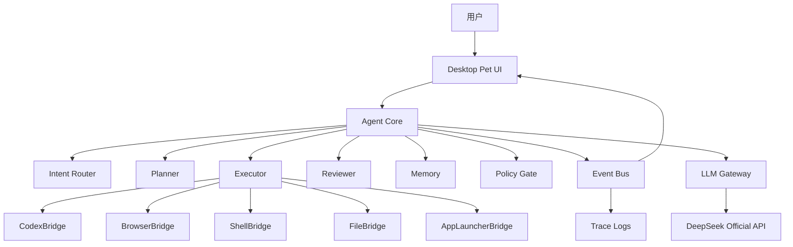
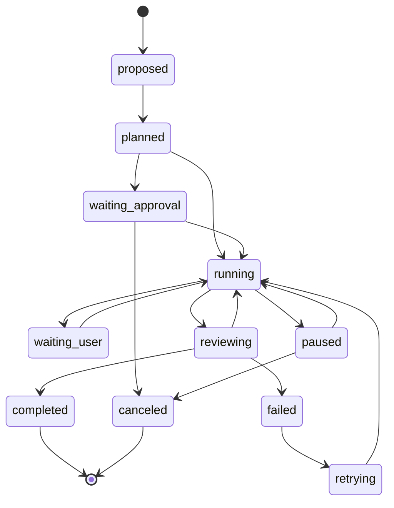

# Agent 架构设计

## 架构目标

Taffy Agent 的 Agent Core 要达到 Hermes/OpenClaw 类工作流系统的核心能力：会规划、会调用工具、会复盘、能长期任务、能观测、能失败恢复，同时保持桌宠 UI 的轻盈体验。

这里不绑定某个外部 Agent 框架。实现上采用能力驱动架构：每个组件有明确输入、输出、状态和失败边界。

## 总体架构



## 核心组件

### Desktop Pet UI

- 展示角色、状态、气泡、任务卡。
- 不直接执行危险动作。
- 所有用户操作转成事件发给 Agent Core。

### Agent Core

- 维护会话、任务、工具状态。
- 对外只暴露结构化任务接口。
- 不把 LLM 文本直接当命令执行。

### Intent Router

判断用户请求属于：

- 普通聊天。
- 桌面控制。
- 浏览器任务。
- 编程/Codex 任务。
- 文件/项目任务。
- 设置/配置任务。
- 高风险任务，需要确认。

输出必须是结构化 JSON。

### Planner

为多步任务生成计划。

计划字段：

```json
{
  "goal": "string",
  "steps": [
    {
      "id": "step-1",
      "tool": "browser|codex|shell|file|none",
      "summary": "string",
      "risk": "low|medium|high",
      "requiresApproval": false
    }
  ],
  "stopConditions": ["string"]
}
```

### Executor

执行工具调用。每次工具调用必须有：

- tool 名称。
- 输入参数。
- 预期结果。
- 风险等级。
- 超时。
- 可取消标识。

### Reviewer

复盘工具结果，判断是否继续。

典型输出：

```json
{
  "decision": "continue|ask_user|retry|revise_plan|complete|fail",
  "summary": "string",
  "nextStepId": "string",
  "reason": "string"
}
```

### Policy Gate

所有副作用动作都先经过 Policy Gate。

策略维度：

- 是否读取用户文件。
- 是否写入文件。
- 是否运行命令。
- 是否打开外部网络。
- 是否登录账号。
- 是否提交表单。
- 是否删除、支付、推送、发布。

### Memory

分层保存：

- Profile Memory：用户偏好。
- Project Memory：项目状态和常用命令。
- Task Memory：任务计划、日志、结果。
- Episodic Memory：可检索的历史对话摘要。

## 任务状态机



## LLM 使用策略

| 场景 | 模型 |
| --- | --- |
| 闲聊、短回复、状态说明 | deepseek-v4-flash |
| 意图路由、JSON 输出 | deepseek-v4-flash |
| 多步规划、复杂代码任务说明 | deepseek-v4-pro |
| 复盘大量日志/diff | deepseek-v4-pro |
| 低成本离线演示 | MockProvider |

## 可观测性

每个任务生成一个 trace：

- `task.json`：目标、计划、状态。
- `events.jsonl`：状态事件。
- `tool-calls.jsonl`：工具调用输入输出摘要。
- `llm.jsonl`：模型请求摘要和 token 统计，不记录密钥。
- `final.md`：用户可读结果。

## 失败恢复

失败分成四类：

- ProviderFailure：DeepSeek API、网络、额度、代理。
- ToolFailure：浏览器、Codex、Shell、文件系统。
- ContractFailure：LLM 输出不符合 JSON schema。
- UserBlocked：等待登录、验证码、确认、账号权限。

每类失败都要给 UI 一个可读原因和可选下一步。

## 架构验收标准

- 任意工具调用都能从日志追踪到来源任务。
- LLM 输出格式错误不会直接执行危险动作。
- 长任务可以暂停、取消、恢复或失败总结。
- Codex/Browser/Shell 任一工具不可用时，其他功能仍可运行。
- MockProvider 下能完整演示 UI 和任务状态机。

