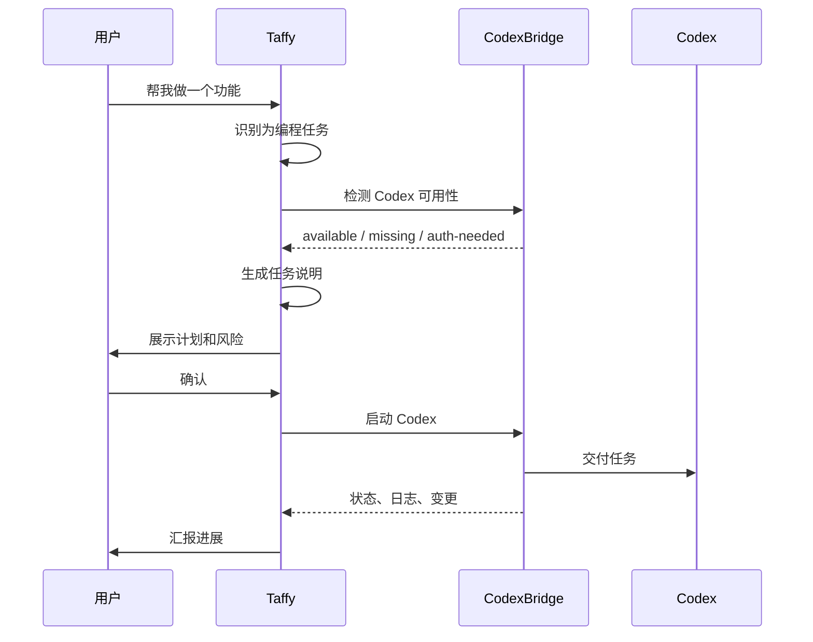

# Codex 联动设计

## 核心边界

Taffy 高度适配 Codex，但不接管 Codex。

必须遵守：

- 不读取 Codex 账号凭据。
- 不保存 Codex API Key。
- 不修改 Codex 登录状态。
- 不自动改 `C:\Users\A\.codex\config.toml`。
- 只检测 Codex 是否可用，并调用本机 Codex 已有能力。

## 设计目标

Taffy 在 Codex 面前扮演三种角色：

1. 任务翻译器：把用户自然语言整理成 Codex 适合执行的任务说明。
2. 项目经理：跟踪 Codex 进度、终端、diff、测试结果。
3. 复盘助手：把 Codex 的结果转成用户能快速理解的总结。

## CodexBridge 能力

| 能力 | 说明 |
| --- | --- |
| detect | 检测 `codex` 命令、版本、工作区可信状态 |
| launch | 在指定目录启动 Codex 任务 |
| handoff | 生成 Codex 任务 prompt |
| monitor | 读取终端输出、文件变更、测试结果 |
| summarize | 总结 diff、测试、剩余问题 |
| resume | 对已有任务追加上下文或继续 |
| fallback | Codex 不可用时给出配置提示 |

## 启动流程



## Handoff Prompt 模板

```text
你是 Codex，请在当前工作区完成以下任务。

目标：
{goal}

用户偏好：
{preferences}

约束：
- 不改无关文件。
- 不读取或保存敏感凭据。
- 修改前先理解现有项目结构。
- 完成后运行相关验证。

已知上下文：
{context}

期望输出：
- 修改了哪些文件。
- 如何验证。
- 剩余风险。
```

## 监控策略

Taffy 不需要理解 Codex 的内部私有状态，只需要观察外部证据：

- 工作区文件变化。
- 终端输出。
- 测试命令结果。
- Git diff。
- Codex 进程是否仍运行。

## 与 Codex 配置的关系

允许读取：

- Codex 是否安装。
- 工作区是否存在。
- 当前目录是否可信。
- 非敏感配置项，例如默认模型名。

禁止读取或保存：

- API Key。
- 登录 token。
- cookie。
- 会话密钥。

## 用户提示

Codex 不可用时只提示：

```text
我这边没有检测到可用的 Codex。请先安装或登录 Codex，完成后我可以继续把任务交给它。
```

Codex 未登录时只提示：

```text
Codex 似乎还没有可用登录状态。我不会接管账号设置，你登录好之后告诉我继续。
```

## Codex 联动验收标准

- 不需要把 Codex API Key 填进 Taffy。
- Codex 缺失/未登录时，Taffy 能优雅提示。
- Taffy 能生成高质量 Codex 任务说明。
- Taffy 能总结 Codex 改动和验证结果。
- CodexBridge 失败不会拖垮桌宠 UI 或其他工具。

