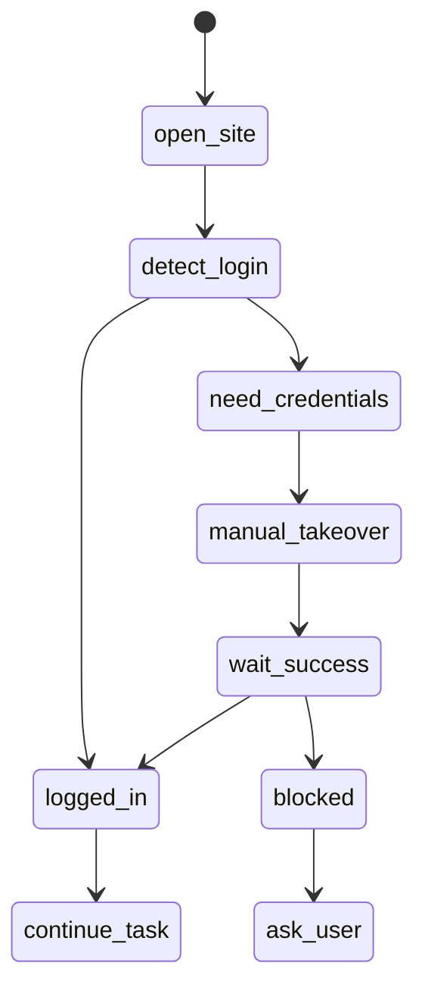

# 浏览器自动化设计

## 目标

BrowserBridge 让 Taffy 能顺滑完成网页检索、信息读取、表单填写、下载、登录后操作和网页任务。但它不绕过验证码、2FA、风控或网站安全限制。

## 推荐实现

优先使用 Playwright 作为底层浏览器控制层：

- 稳定控制 Chromium。
- 可读 DOM、截图、等待元素、下载文件。
- 支持持久化 profile。
- 便于测试和复现。

可选对接 Codex 的 Browser Use 插件能力，用于在 Codex 内部浏览器辅助调试本地页面。Taffy 自身 BrowserBridge 仍建议保持独立。

## 浏览器模式

### Ephemeral Profile

临时会话。

- 适合公开网页检索。
- 关闭后清理 cookie/cache。

### Persistent Profile

持久会话。

- 适合用户常用网站。
- cookie 保存在本地 profile 目录。
- 默认不保存密码。

### Manual Takeover

人类接管。

- Agent 暂停点击和输入。
- 用户在浏览器中完成登录、验证码、2FA。
- Taffy 观察页面状态，检测成功后继续。

## 操作能力

| 能力 | 说明 |
| --- | --- |
| open | 打开 URL 或搜索结果 |
| read | 提取页面正文、标题、链接、表格 |
| click | 点击按钮/链接 |
| type | 输入文本 |
| select | 选择下拉项 |
| upload | 上传用户指定文件 |
| download | 下载并记录文件路径 |
| screenshot | 截图给用户确认 |
| wait | 等待元素、网络空闲、URL 改变 |
| extract | 结构化提取信息 |
| takeover | 请求用户接管 |

## 登录流程



## 登录原则

- 默认不让 LLM 看到密码。
- 默认不保存密码。
- 用户可以选择保存站点 session，但要明确提示保存位置。
- 2FA、短信、邮箱验证码由用户输入。
- CAPTCHA 由用户处理，Taffy 只等待结果。
- 支付、购买、账号删除、权限授权必须额外确认。

## 验证场景

| 场景 | Taffy 行为 |
| --- | --- |
| 图片验证码 | 暂停，提示用户完成 |
| 短信/邮箱验证码 | 暂停，用户输入 |
| 2FA App | 暂停，用户确认完成 |
| Passkey | 暂停，用户系统级确认 |
| 风控提示 | 暂停并解释页面要求 |
| 支付确认 | 高风险确认，不自动提交 |

## 页面理解

BrowserBridge 输出结构化 page snapshot：

```json
{
  "url": "string",
  "title": "string",
  "visibleText": "string",
  "forms": [],
  "buttons": [],
  "links": [],
  "screenshotPath": "string",
  "loginState": "unknown|logged_in|logged_out|blocked"
}
```

LLM 基于 snapshot 决策，而不是盲目猜坐标。

## 丝滑体验设计

- 浏览器自动化时，桌宠显示“当前网页+当前动作”。
- 登录时自动切成 Manual Takeover，并把浏览器带到前台。
- 用户完成后不用复制粘贴，只需点击“继续”或让 Taffy 自动检测。
- 失败时给出页面证据，例如 URL、可见错误文本、截图。

## 浏览器验收标准

- 能完成公开网页搜索、阅读、下载。
- 能打开需要登录的网站并顺利切换到用户接管。
- 用户登录成功后，任务能继续。
- 不绕过验证码或 2FA。
- 每个自动动作都有日志和失败原因。

