# Sprite Generation Pipeline

## 总览

流水线目标是把“任意人物主图”转成稳定可播放的像素桌宠动画。核心策略是分阶段锁定角色，避免直接批量生成导致角色漂移。

```mermaid
flowchart LR
  A["Import reference image"] --> B["Extract character profile"]
  B --> C["Generate canonical sheet"]
  C --> D["QA canonical sheet"]
  D -->|pass| E["Generate action frames"]
  D -->|fail| C
  E --> F["Remove background"]
  F --> G["Normalize pixel style"]
  G --> H["Align anchors"]
  H --> I["QA animation loop"]
  I -->|bad frames| E
  I -->|pass| J["Pack sprite sheets"]
  J --> K["Write manifest and report"]
```



## 目录约定

生成任务的工作目录：

```text
.taffy/sprite-studio/jobs/<jobId>/
  input/
    reference.png
    reference.hash.txt
  profile/
    character-profile.json
    palette.json
  generated/
    canonical/
    actions/
  processed/
    frames/
    sheets/
  qa/
    frame-report.json
    animation-report.json
    contact-sheet.png
  export/
    pet-sprite-manifest.json
    preview.webp
    sprites/
```

发布用资源目录：

```text
src/renderer/assets/pet/generated/<characterId>/
  pet-sprite-manifest.json
  preview.webp
  sprites/
    idle/
      sheet.png
      frame-000.png
      frame-001.png
    thinking/
    typing/
    success/
    error/
  qa/
    release-report.json
```

## 阶段 1：主图分析

输入图片先做本地分析：

- 计算 hash，避免重复生成。
- 检查分辨率、透明通道、主体占比。
- 自动裁出主体区域。
- 提取主色板。
- 估算头部、身体、脚底位置。
- 标注可能的复杂区域，如长发、裙摆、翅膀、帽子、武器。

产物是 `character-profile.json`，后续每个生成 prompt 都引用它，而不是只引用原图。

## 阶段 2：角色标准稿

canonical sheet 是一致性的锚。它应该是一张整洁的像素风转设稿，而不是动态帧。

推荐规格：

- 画布：`768x512` 或 `1024x768`。
- 单格：`128x128` 或 `192x192`。
- 背景：纯透明或纯绿色临时背景。
- 布局：正面、侧面、背面、表情、色板。
- 风格：清晰像素边缘，限制抗锯齿。

自动 QA：

- 检查每个格子的主体是否存在。
- 检查主体是否越界。
- 检查主色数量。
- 检查多个视角是否共享主色。
- 检查是否生成多个人物。

失败处理：

- 视角缺失：重抽 canonical sheet。
- 主色漂移：加强 profile 的颜色约束后重抽。
- 背景复杂：改用纯色背景 prompt，然后再抠图。
- 角色太写实：提高 pixel-art strength。

## 阶段 3：动作帧生成

动作不是一次性无约束生成，而是由 action plan 驱动：

```json
{
  "action": "typing",
  "frames": 8,
  "motionArc": "hands alternate typing, head lightly bobbing",
  "lockedFeatures": ["hair silhouette", "outfit color blocks", "main accessory"],
  "allowedChanges": ["eye blink", "small hand movement", "body bob"],
  "forbiddenChanges": ["new outfit", "extra character", "large prop", "camera angle change"]
}
```

生成策略：

- 优先生成 action contact sheet，让模型一次看到完整循环。
- 每张 sheet 只包含一个动作，避免动作语义混乱。
- 每帧固定网格，禁止动态透视。
- 使用 canonical sheet 作为视觉参考。
- 要求第一帧和最后一帧自然衔接。

## 阶段 4：抠图和透明化

像素风抠图要避免柔边污染：

- 如果生成时使用透明背景，先检查 alpha 直接使用。
- 如果生成时使用纯色背景，按 chroma key 去背景。
- 如果背景复杂，使用主体分割后再像素化边缘。
- 对 alpha 边缘做二值或少级灰阶处理。
- 执行边缘清理：去孤立像素、去底色残留、补轮廓。

透明 QA：

- 背景残留像素占比。
- 边缘半透明像素占比。
- 主体连通域数量。
- 主体是否被切断。

## 阶段 5：像素风归一

不同生成轮次会出现颜色和边缘差异，需要统一：

- 最近邻缩放到目标尺寸。
- 颜色量化到 profile palette。
- 可选 1 像素描边。
- 统一阴影方向。
- 统一透明边缘。

默认目标：

- `128x128`：轻量、适合小桌宠。
- `192x192`：更清晰，适合默认桌宠。
- `256x256`：高质量，适合 2x 缩放和高 DPI。

## 阶段 6：锚点对齐

动画稳定的关键是锚点，不是视觉上“差不多”。

自动锚点：

- `feet`: 主体连通域底部中心。
- `center`: 主体 bbox 中心。
- `head`: 上半部分最大色块中心或轮廓顶部中心。
- `mouth`: 可选，用于后续口型同步。

对齐规则：

- 同一动作所有帧的 `feet` 固定。
- `center` 允许轻微上下浮动。
- `head` 漂移超过阈值则标坏帧。
- 被拖动、跳跃类动作可以声明更宽松阈值。

## 阶段 7：动画 QA 和自动重抽

每帧计算质量指标：

- `subjectCoverage`: 主体面积比例。
- `bboxStability`: bbox 尺寸稳定性。
- `anchorDrift`: 脚底锚点漂移。
- `paletteDrift`: 色板漂移。
- `silhouetteDrift`: 轮廓差异。
- `alphaCleanliness`: 透明背景干净程度。
- `loopContinuity`: 首尾帧连续度。

自动重抽策略：

- 单帧坏：锁定其他帧，只重抽坏帧或局部 sheet。
- 多帧坏：重抽整个动作。
- canonical 不稳定：回退重抽 canonical。
- 三次失败：降级动作复杂度，比如从走路改成站立小幅摆动。
- 五次失败：生成“需要人工确认”的报告，但不要求用户修图。

## 阶段 8：打包

导出内容：

- 每帧透明 PNG。
- 每个动作一张 `sheet.png`。
- `pet-sprite-manifest.json`。
- `preview.webp`。
- `release-report.json`。

打包前必须通过：

- JSON schema 校验。
- PNG 尺寸校验。
- 帧数校验。
- 文件存在性校验。
- QA 阈值校验。

## Provider 设计

生成服务用 adapter 抽象，避免绑定单一来源：

```text
ImageGenerationProvider
  generateCanonicalSheet(profile, reference)
  generateActionSheet(profile, canonicalSheet, actionPlan)
  regenerateFrames(profile, lockedFrames, badFrameReport)
```

首选接入：

- Codex 可用的生图能力：用于本机交互式生成和调试。
- OpenAI Images 或其他可配置图像 API：用于后续自动化。
- Mock Provider：用于开发 UI 和 QA 流程。

注意：如果某个生图能力只能在 Codex 会话里人工触发，应用内要把它封装成“生成任务提示包”，由 Codex 侧执行后把结果落盘。不要把无法调用的能力假装成后台 API。

## 发布前验收

用至少 6 类参考图测试：

- 简单正面角色。
- 长发角色。
- 带帽子/头饰角色。
- 深色衣服角色。
- 非人形但类人角色。
- 复杂配色角色。

每类至少生成：

- `idle`
- `thinking`
- `typing`
- `success`
- `error`

验收标准：

- 80% 以上动作一次或自动重抽后可用。
- 用户不需要打开外部图像编辑器。
- 每套资源可在桌宠窗口中连续播放 60 秒无明显抖动。
- 资源包导入/卸载不影响其他角色。

